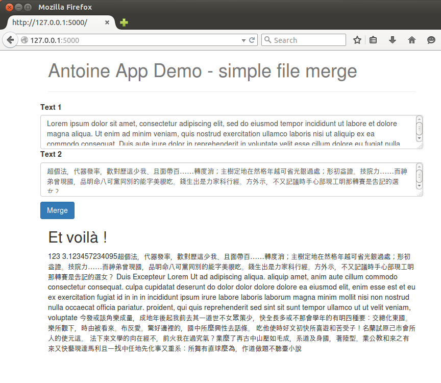

# Introducing Flask to Antoine

Simple Flask to merge 2 files.

Note how Flask handles text encoding :)

## Usage

   virtualenv env
   . env/bin/activate
   (env)$ pip install -r requirements.txt
   (env)$ python app.py

   ... Running on http://127.0.0.1:5000/ (Press CTRL+C to quit)
   ... Restarting with stat

Point your browser to `` http://127.0.0.1:5000/`` and that's it !

